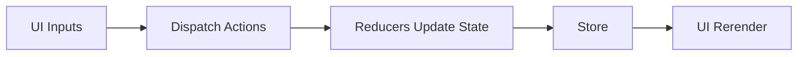

# Plan for Task Management Application

1. **Project Setup**  
   - Initialize a React + Redux + Webpack project  
   - Use recommended file structure  

2. **Data Model**  
   - tasks: { id, title, category, priority, dueDate, completed }  
   - filters: { statusFilter, categoryFilter, searchTerm, sortByPriority }  

3. **Features**  
   - Filter tasks by completion  
   - Categorize tasks and filter by category  
   - Sort tasks by priority  
   - Search tasks by title  
   - Drag and drop to reorder tasks  
   - Set due dates and highlight approaching deadlines  

4. **Redux Flow**  
   - Use actions and reducers for tasks and filter changes  
   - Keep track of state in the store  

5. **Plan Implementation**  
   - Create TaskList, TaskView, FilterBar components  
   - Implement drag-and-drop with react-dnd or alternative  
   - Integrate a date picker for due dates  
   - Optional: Add authentication, make UI responsive, persist data in local storage